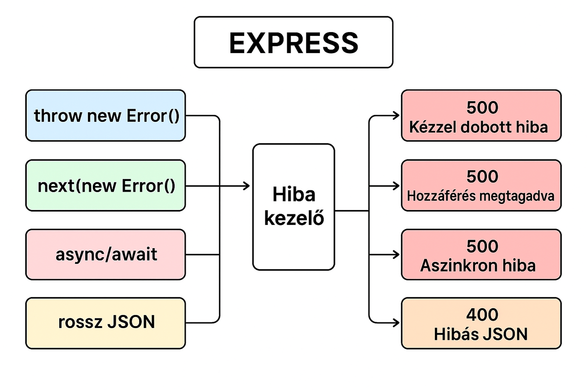

# Tesztelés

| Útvonal                     | Mit csinál                | Eredmény                            |
| --------------------------- | ------------------------- | ----------------------------------- |
| `GET /throw`                | `throw new Error()`       | 500 + "Kézzel dobott hiba történt!" |
| `GET /next`                 | `next(new Error())`       | 500 + "Hozzáférés megtagadva!"      |
| `GET /async`                | Aszinkron hiba (`reject`) | 500 + "Aszinkron hiba!"             |
| `POST /json` hibás JSON-nal | pl. `{ "nev": "Sanyi"`    | 400 + "Hibás JSON formátum!"        |
| `GET /valami`               | Nem létező útvonal        | 404 + "Az oldal nem található."     |

## Folyamatábra

