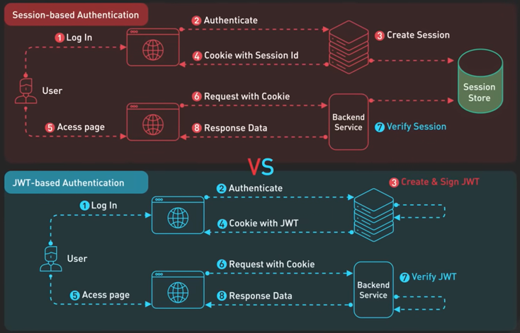

# Authentication

Ha valamilyen szolgáltatást engedélyhez kötünk, akkor **MINDEN** művelet előtt be kell azonosítani a kérést kérő személyét.

## Session vs JWT

| Szempont             | Session azonosítás (Stateful)                                                                                           | JWT azonosítás (Stateless)                                                                       |
| -------------------- | ----------------------------------------------------------------------------------------------------------------------- | ------------------------------------------------------------------------------------------------ |
| Fő különbség         | A szerver tárolja az állapotot.                                                                                         | A token tárolja az állapotot.                                                                    |
| Fő előny             | Könnyű visszavonás (kijelentkezés).                                                                                     | Könnyű horizontális skálázás.                                                                    |
| Folyamatok           | Szinkron és Aszinkron is.                                                                                               | Szinkron és Aszinkron is.                                                                        |
| Helyes megfogalmazás | Nagyobb terhelést jelent a szinkron/elosztott környezetekben, ahol az állapotot szinkronizálni kell a szerverek között. | Ideális a skálázható/elosztott rendszerekhez, amelyek jól kezelik a rövid élettartamú tokeneket. |

A JWT legfőbb előnye tehát a session azonosítással szemben a könnyebb skálázhatóságban és az állapotmentességben jelentkezik. Mindkét mechanizmus használható mind szinkron, mind aszinkron webes kommunikációban.

## [Basic Authentication](./Basic/)

## [Bearer Tokens](./Bearer_Tokens/)

## [OAuth2 Authentication](./OAuth2/)

## [JWT Tokens](./JWT/)

## Access Tokens *(Hozzáférési Token)*

- **Célja**: Engedélyezés *(Authorization)*. Az erőforrás-szervernek *(pl. az API-nak)* szól, és igazolja, hogy a kliens (alkalmazás) jogosult a felhasználó nevében bizonyos műveletek végrehajtására *(adatok olvasása, írása, stb.)*.

- **Formátum**: Gyakran JWT (JSON Web Token) formátumú Bearer Token.

- **Használat**: Minden egyes, védett erőforrásra irányuló HTTP kérésnél el kell küldeni az `Authorization: Bearer <Access Token>`-t a fejlécben.

- **Élettartam**: Rövid. Általában percektől órákig terjed *(pl. 5 perc, 1 óra)*. A rövid élettartam növeli a biztonságot. Ha egy Access Token-t ellopnak, az csak rövid ideig használható a támadáshoz.

## Refresh Tokens

- **Célja**: Új Access Token kérése az engedélyező szervertől, hogy a felhasználói munkamenet hosszabb ideig tartson anélkül, hogy a felhasználónak újra be kellene jelentkeznie a felhasználónévvel és jelszóval.

## Single Sign-On (SSO) and Identity Protocols

A Single Sign-On (SSO) egy olyan hitelesítési séma, amely lehetővé teszi a felhasználó számára, hogy egyetlen bejelentkezéssel (azaz egyszeri hitelesítő adatok megadásával) több, egymástól független rendszerhez vagy alkalmazáshoz is hozzáférjen.

pl. Microsoft 365
